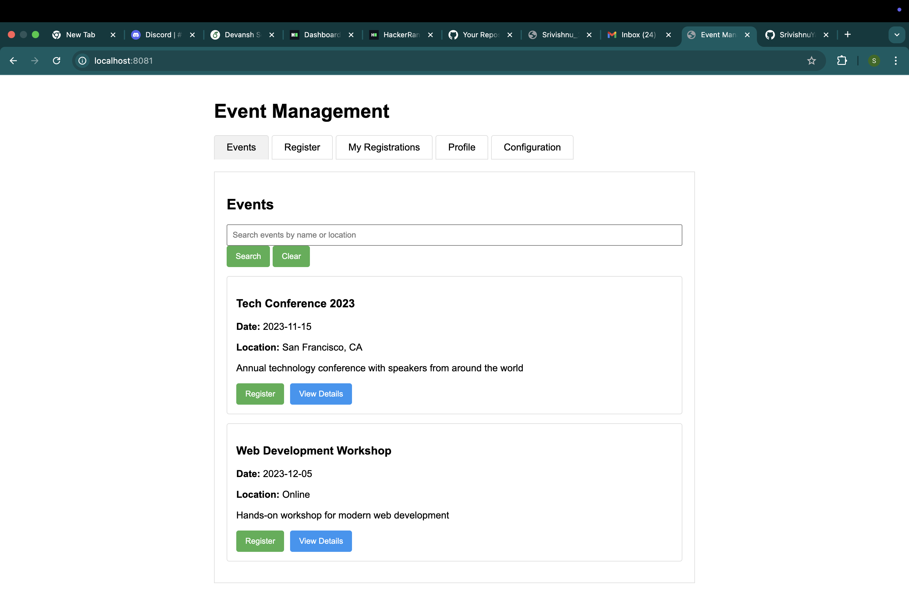
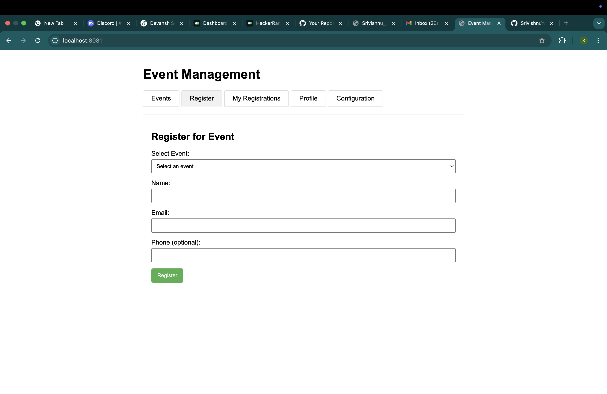
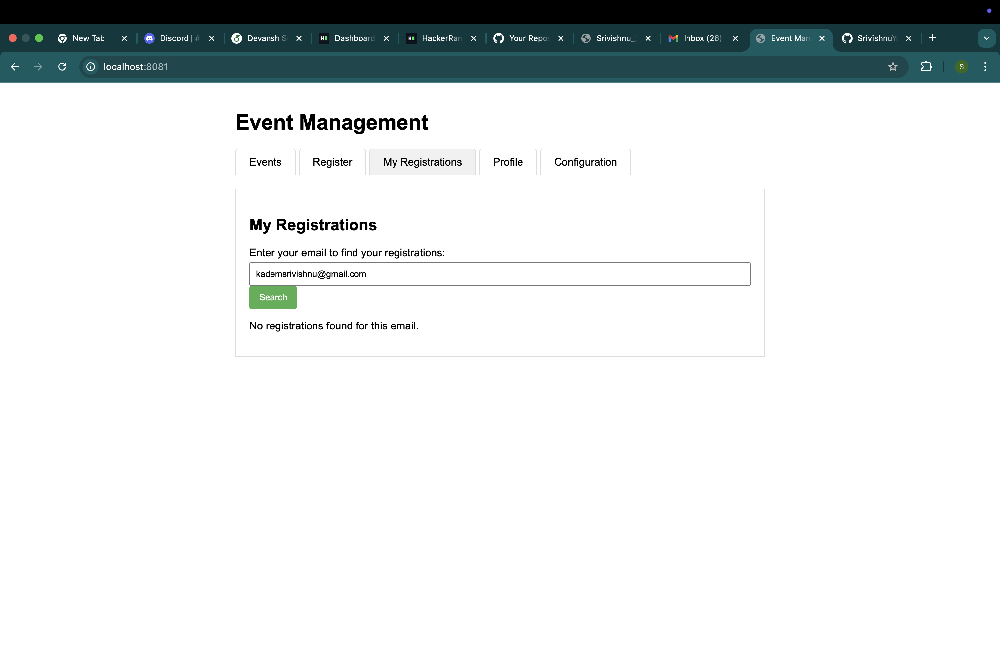

# Serverless Event Management API

A serverless application for managing events and registrations using AWS Lambda, API Gateway, DynamoDB, and SES.



## Features

- Create and manage events
- Register for events
- Search events by name or location
- User authentication and profiles
- Email notifications for registrations
- Mobile-friendly responsive design

## Architecture

This application uses a serverless architecture with the following AWS services:

- **AWS Lambda**: For executing code in response to events
- **Amazon API Gateway**: For creating RESTful APIs
- **Amazon DynamoDB**: For storing event and registration data
- **Amazon SES**: For sending email notifications
- **DynamoDB Streams**: For processing registration events asynchronously

## Local Development

### Prerequisites

- Node.js (v16 or later)
- npm (v7 or later)

### Installation

1. Clone this repository
   ```
   git clone https://github.com/yourusername/serverless-event-api.git
   cd serverless-event-api
   ```

2. Install dependencies
   ```
   npm install
   ```

3. Start the mock API server
   ```
   npm run mock-api
   ```

4. In a new terminal, start the frontend server
   ```
   npm run frontend
   ```

5. Open your browser to http://localhost:8081

6. When prompted for the API URL, enter:
   ```
   http://localhost:3000
   ```

### Using the Application

1. **Browse Events**
   - View all events on the main page
   - Search for events by name or location
   - Click "View Details" to see more information

2. **Register for Events**
   - Click "Register" on any event
   - Fill in your details and submit
   - Receive a confirmation message

3. **View Your Registrations**
   - Go to the "My Registrations" tab
   - Enter your email address
   - View and manage your registrations

4. **User Profile**
   - Create an account or log in
   - Update your profile information
   - Your information will be pre-filled in registration forms

## API Endpoints

The API provides the following endpoints:

- `GET /events` - List all events
- `GET /events?search=query` - Search events
- `GET /events/{id}` - Get event details
- `POST /events` - Create a new event
- `POST /events/{id}/register` - Register for an event
- `GET /events/{id}/registrations` - List registrations for an event
- `GET /registrations?email=user@example.com` - Get registrations by email
- `DELETE /registrations/{id}` - Cancel a registration

## Mock Data

The mock API server includes sample data:

- Two example events
- Demo user account (demo@example.com / password123)

## Screenshots

### Events List


### Event Details


### Registration Form


### My Registrations


## AWS Deployment (Optional)

If you have an AWS account, you can deploy this application to AWS:

1. Configure AWS CLI with your credentials
   ```
   aws configure
   ```

2. Run the deployment script
   ```
   ./scripts/deploy.sh
   ```

3. Follow the prompts to verify your SES email

4. Update the frontend with your API Gateway URL

## License

MIT

## Author

Your Name